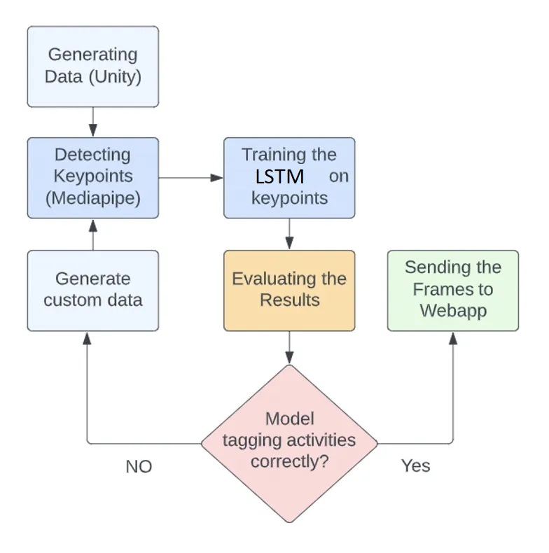
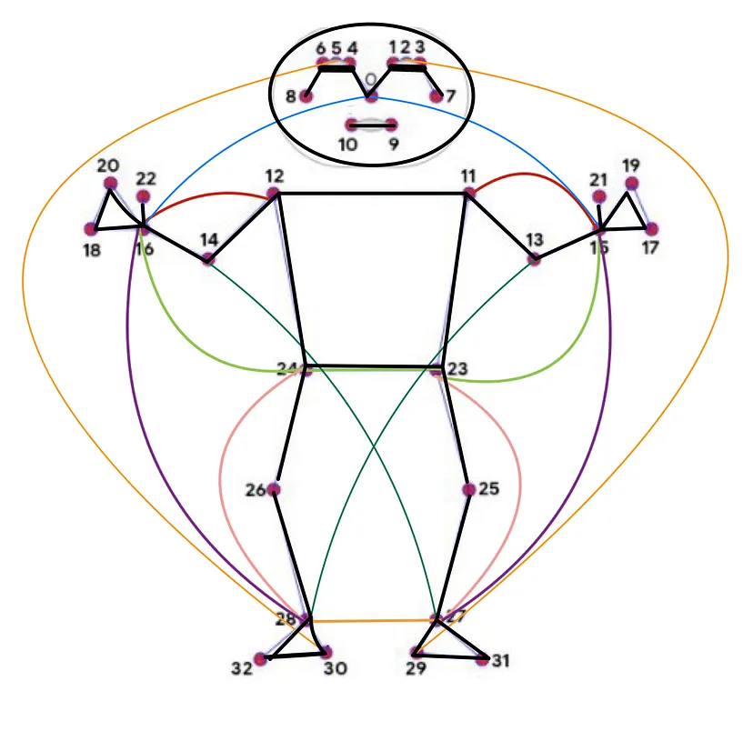
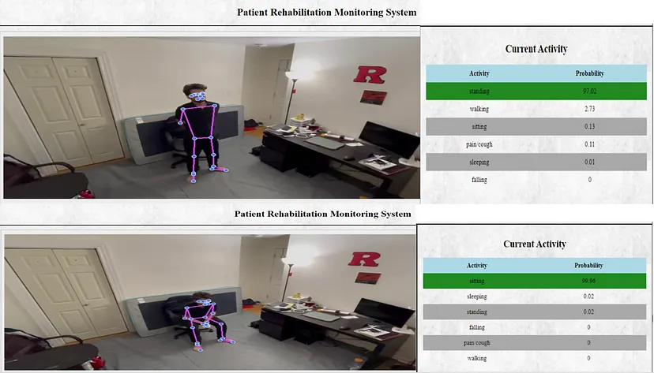

**Introduction**

This repository presents a patient monitoring system utilizing an LSTM model. The system aims to automate patient activity tracking, alerting concerned authorities during emergencies, and potentially providing cost-effective surveillance compared to human monitoring. By detecting abnormal behaviors, such as collapse, heart attack, or seizures, this system seeks to mitigate complications or fatalities in rehab centers.

**Approach**

**Dataset**

Since it was difficult to get real data from a rehab center and then train the model for some specific events, synthetic data using Unity3D was generated. This was done by collecting multiple characters and animations from mixamo and importing them in Unity 3D and generating simulations through C# script. The training data was divided into two broad categories; Activities that are considered normal and those which are considered abnormal. Please refer to the figure and video below.
Normal activities- Sitting, Standing, Walking, Sleeping
Abnormal activities- Falling, Pain, Coughing

**Methodology**

Mediapipe (blaze pose) was used to extract the key points from the simulated frames. The Mediapipe returns 33 key points and since each point is 3 dimensional (x, y, z), a total of 99 features were returned. To get better results, an additional 19 features were computed, which were distances between selected key points. 

15–16 15–11 12–16 15–23 16–24
23–24 16–28 15–27 23–27 24–28
28–27 5–30 2–29 14–27 13–28
0–15 0–16 26–25 31–32

These points were selected based on the estimated position and distance between the skeletal points for various activities. Therefore, a total of 99 + 19, i.e., 118 normalized feature points were gathered and were passed as input to the model. 

In terms of model input, as we know that LSTMs take 3-dimensional data in which the dimensions are [samples, time steps, features] So for the training purpose of our model we have taken 52,128 samples, our time step = 60 and features are 118 . 

The model was tested on both simulated and real data and gave quite good results. It predicted correctly for most activities but had some misclassification for activities that have similar key points structure such as walking and standing. Some more misclassification was also observed during the activity transition.

Results:

Here is the final inference video of the model: [Video](https://www.youtube.com/watch?v=zA1YFdSc1ZU)

